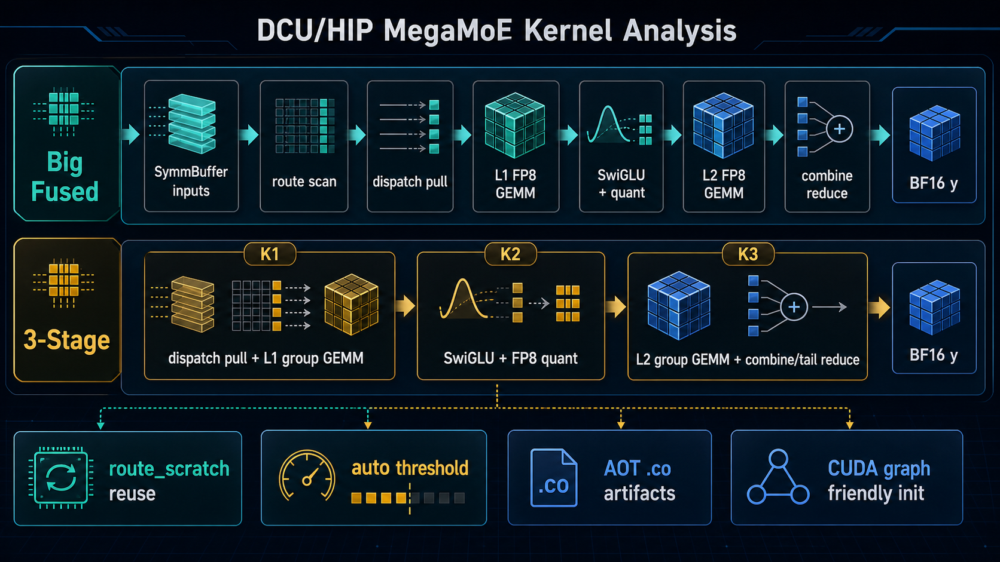
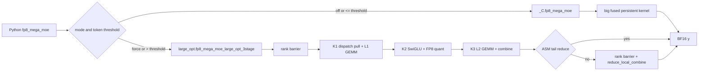
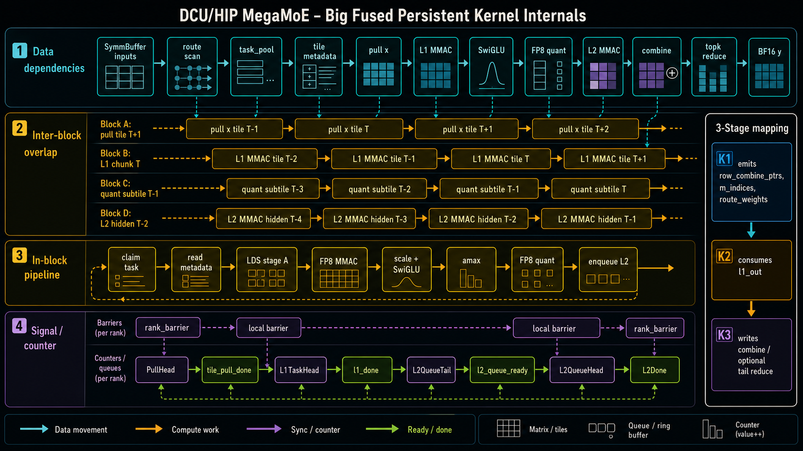

# DCU/HIP MegaMoE Kernel Analysis

> 本文梳理当前工程里的 DCU/HIP W8A8 MegaMoE 实现，重点覆盖 `big fused kernel`
> 和 `3-stage fused kernel` 两条执行路径。结构上参考了
> [DeepSeek-V4详细分析(2): MegaMoE](https://mp.weixin.qq.com/s/S-ej9ybT3sbFA8dqHLZafg)
> 的长文式组织方式：先讲背景和全局流，再讲 scheduler、buffer layout，最后落到代码细节。
> 内容以本仓库当前代码为准，不复述原文。



## TL;DR

当前 DCU MegaMoE 包对外暴露的入口是 `megamoe.fp8_mega_moe()` 和别名
`megamoe.fp8_w8a8_mega_moe()`。在 HIP/DCU 构建下，Python 层默认使用
`MEGAMOE_DCU_USE_LARGE_OPT_3STAGE=auto` 的语义：token 数不超过阈值时走原来的
big fused persistent kernel，超过阈值时走 3-stage large-opt 路径。默认阈值是
`MEGAMOE_DCU_LARGE_OPT_3STAGE_TOKEN_THRESHOLD=128`，比较关系是
`num_tokens_per_rank > threshold` 才进入 3-stage。

两条路径复用同一套 `SymmBuffer` 输入区域、peer pointer、signal buffer 和
`route_scratch`。3-stage 集成没有再引入一个独立的持久 large workspace，而是在
`route_scratch` 中切出 K1/K2/K3 需要的 BF16/FP8/scale/prob/tail-signal 视图。
这样能兼顾后续小 token 继续跑 big fused、大 token 跑 3-stage 的目标，避免显存上
为两套路径重复常驻大 buffer。

big fused 是一个 multi-rank persistent kernel：在一个 kernel 内完成 route scan、
dispatch pull、L1 FP8 GEMM、SwiGLU、FP8 quant、L2 FP8 GEMM、combine reduce。它的小
token 延迟更低，内部通过跨 rank barrier 和本地 block barrier 做通信/计算衔接。

3-stage 则把大融合拆成三个更粗的 kernel 阶段：

- K1: 融合 dispatch pull + L1 FP8 grouped GEMM，输出 `l1_out`、`route_weights`、
  `m_indices`、`output_index` 和 `row_combine_ptrs`。
- K2: 融合 SwiGLU + channelwise FP8 quant，baseline 也复用同一个优化过的 K2，以保证
  swiglu/quant 口径公平。
- K3: 融合 L2 FP8 grouped GEMM + combine partial 写入。默认走 ASM tail-reduce，
  K3 汇编尾部直接做本地 topk reduce 并写 `y`；只有显式设置
  `K3_USE_ASM_TAIL_REDUCE=0` 时，K3 后才跟 rank barrier 和一个
  `reduce_local_combine` kernel。

从目前 sweep 结果看，32/64/128 token 更适合 big fused，256 及以上 3-stage 优势明显。
因此工程默认阈值 128 是符合当前性能曲线的保守选择。

## 目录

1. 总体架构
2. Baseline 与公平性口径
3. Big Fused Kernel
4. 3-Stage Fused Kernel
5. Scheduler 对比
6. Buffer Layout 与显存复用
7. 环境变量与运行期分流
8. 编译、AOT 产物与 wheel 布局
9. 单测与性能脚本
10. CUDA Graph 亲和性
11. 关键代码索引
12. 后续优化观察点

## 1. 总体架构

### 1.1 对外 API

当前 DCU/HIP 包名是 `megamoe`。Python 侧入口在
[`megamoe/__init__.py`](megamoe/__init__.py)：

- `get_symm_buffer_for_mega_moe(...)`: 对 `num_max_tokens_per_rank` 做 token alignment，
  然后创建 `SymmBuffer`。
- `transform_fp8_weights_for_mega_moe(l1_weights, l2_weights)`: 做 grouped weight 的
  channelwise FP8 量化和 Marlin `nt_kpack2` 重排。
- `fp8_mega_moe(...)`: 根据环境变量和 token 数选择 big fused 或 3-stage。
- `fp8_w8a8_mega_moe = fp8_mega_moe`: 框架接入侧可以继续使用 W8A8 命名。

`SymmBuffer` 是两条路径的共同上下文。它在初始化时做几件事：

- 通过 `_C.get_symm_buffer_size_for_mega_moe()` 计算 symmetric IPC buffer 大小。
- 通过 `_C.get_mega_moe_route_scratch_size_for_mega_moe()` 计算 route scratch 大小。
- 分配 HIP IPC buffer、route scratch 和 signal buffer。
- all-gather 各 rank 的 IPC handle，并把 peer `sym_buffer_ptrs`、`signal_ptrs` 写入设备端
  header。
- 切出输入视图：`x`、`x_sf`、`topk_idx`、`topk_weights`。
- 如果 large-opt 模式是 `force` 或 `auto`，提前调用
  `prepare_large_opt_3stage()`，把 3-stage 状态准备好。

### 1.2 两条执行路径

`fp8_mega_moe()` 的分流逻辑很薄：

```text
if large_opt_selected(num_tokens, mode, threshold):
    fp8_mega_moe_large_opt_3stage(...)
else:
    _C.fp8_mega_moe(...)
```

其中 `_C.fp8_mega_moe(...)` 是 C++/HIP 绑定入口，最终 launch
`mega_moe_multirank_persistent_w8a8_channelwise_kernel`。3-stage 则进入
[`megamoe/large_opt.py`](megamoe/large_opt.py)，依次调用 K1/K2/K3 包装。

精确流水如下：



## 2. Baseline 与公平性口径

测试脚本是 [`tests/test_mega_moe_dcu.py`](tests/test_mega_moe_dcu.py)。它使用
DeepEP 的 dispatch/combine 和 DeepGEMM grouped FP8 GEMM 组成 baseline：

1. `ep_buffer.get_dispatch_layout(...)` 计算 EP dispatch layout。
2. `ep_buffer.dispatch(...)` 做 DeepEP normal dispatch。
3. `deepep_deepgemm_preprocess_channelwise(...)` 把 DeepEP 收到的 token 整理成
   DeepGEMM grouped GEMM 需要的 layout。
4. `deepgemm.m_grouped_fp8_gemm_nt_contiguous(...)` 执行 L1 grouped GEMM。
5. `swiglu_quant_channelwise_out(...)` 执行优化过的 K2 SwiGLU + quant。
6. 再次 `deepgemm.m_grouped_fp8_gemm_nt_contiguous(...)` 执行 L2 grouped GEMM。
7. `deepep_deepgemm_postprocess_channelwise(...)` 或 Triton gather 把 L2 输出写回。
8. `ep_buffer.combine(...)` 做最终 combine。

这里有一个重要公平性点：baseline 的 SwiGLU + quant 不是普通 PyTorch 手写实现，而是复用
3-stage 中已经优化过的 K2 kernel。这样比较时，big fused/3-stage 与 baseline 的差异主要来自
dispatch、grouped GEMM 调度、combine、buffer 流程，而不是 K2 激活量化实现差异。

测试脚本默认 `--atol=0.0035`。这个容忍度来自 DCU big fused 在小 token 场景下的 FP8/BF16
数值路径差异：此前 64 token 曾观察到单点 `max_abs` 稍高于 0.003，但未表现为 reduce 同步或
combine 残留问题。

## 3. Big Fused Kernel

### 3.1 入口和 shape contract

big fused 的 C++ 入口在 [`csrc/apis/mega_dcu.hpp`](csrc/apis/mega_dcu.hpp)：

- `fp8_mega_moe(...)` 做 dtype、shape、recipe、buffer 大小检查。
- `recipe` 必须是 `(1, 1, 32)`。
- `activation` 当前只支持 `swiglu`。
- 输入/权重是 FP8 E4M3，scale 是 FP32 channelwise。
- `fast_math=False` 不支持。

真正的 launch 包装在 [`csrc/kernels/mega_moe_fused_hip.cu`](csrc/kernels/mega_moe_fused_hip.cu)。
当前注册的 DCU shape 是：

```text
num_ranks       = 8
num_experts     = 256
experts_per_rank= 32
topk            = 6
hidden          = 4096
intermediate    = 2048
```

对应 `DcuMegaMoeEp8Config`，定义在
[`deep_gemm/include/deep_gemm/impls/mega_moe_dcu.cuh`](deep_gemm/include/deep_gemm/impls/mega_moe_dcu.cuh)：

```text
threads         = 256
blocks          = 192
route_tile_m    = 32
L1 tile N       = 256
L1 K stage      = 1024 bytes, LDS A pad 64 bytes
L2 tile N       = 512
L2 K stage      = 512 bytes
L2 schedule     = ExpertHiddenMajor<16>
```

host 侧根据当前 token 数估算本次需要的 route scratch tiles：

```text
total_route_tasks = num_ranks * num_tokens * topk
route_scratch_tiles = experts_per_rank + ceil(total_route_tasks / route_tile_m)
```

### 3.2 SymmBuffer 输入协议

设备端使用 [`deep_gemm/include/deep_gemm/comm/mega_moe_dcu.cuh`](deep_gemm/include/deep_gemm/comm/mega_moe_dcu.cuh)
里的 `get_sections(...)` 解释 `sym_buffer`：

```text
sym_buffer header:
  peer sym_buffer ptrs
  peer signal ptrs

per-rank payload:
  x              [max_tokens, hidden]      FP8
  x_sf           [max_tokens]              FP32
  topk_idx       [max_tokens, topk]        int64
  topk_weights   [max_tokens, topk]        FP32
  combine        [topk, max_tokens, hidden] BF16 bits
```

Python 只暴露前四个输入视图，`combine` 是 kernel 内部通过 offset 访问的临时 partial 区域。
这个设计对两条路径都很关键：K3 的 row pointer 实际上也指向这里的 combine slot。

### 3.3 route_scratch layout

route scratch 的 host/device layout 在
[`deep_gemm/include/deep_gemm/layout/mega_moe_dcu.cuh`](deep_gemm/include/deep_gemm/layout/mega_moe_dcu.cuh)。
它分两段：

第一段是 route task workspace：

```text
expert_counts[experts_per_rank]
expert_task_pool[experts_per_rank, num_ranks * num_ranks * max_tokens]
```

第二段是 route tile scratch，主要包括：

```text
x_fp8 pool
act_bf16
act_fp8
act_scale
act_chunk_amax
tile_x_row_ptrs
tile_combine_row_ptrs
tile_route_weight
tile_x_scale
tile_expert
tile_pool_base
tile_count
expert_l1_task_offsets
expert_quant_done_counts
l2_group_done_counts
tile_pull_done
l1_done_counts
l2_queue
l2_queue_ready
pipeline_counters
total_tiles
```

big fused 在一个 kernel 内反复读写这些 scratch 段。3-stage 集成后也复用这块存储，只是用
Python 侧 `_route_scratch_views(...)` 切出 K1/K2/K3 需要的视图。

### 3.4 Persistent kernel 主流程

核心 kernel 是：

```text
mega_moe_multirank_persistent_w8a8_channelwise_kernel<KernelConfig>
```

它的执行可以分为五个阶段。

#### 阶段 1: route scan

所有 block/线程遍历：

```text
task in [0, num_ranks * num_tokens * topk)
```

每个 task 解码出：

```text
topk_slot
token_idx
source_rank
expert
route_weight
```

如果 expert 属于本 rank，则：

```text
local_expert = expert - rank_idx * experts_per_rank
pool_idx = atomicAdd(expert_counts[local_expert], 1)
expert_task_pool[local_expert, pool_idx] = task
```

如果 route 无效，则把对应 combine partial 清零，避免最终 reduce 读到旧数据。

#### 阶段 2: build route tiles

block 0 thread 0 根据 `expert_counts` 把每个 local expert 的任务切成 route tile：

```text
route_tile_m = 32
tile_experts[tile] = local_expert
tile_pool_bases[tile] = pool_base
tile_counts[tile] = min(route_tile_m, expert_task_count - pool_base)
```

同时生成 `expert_l1_task_offsets`，用于后续 L1 scheduler 按 expert/chunk-major 方式解码任务。

然后初始化：

```text
expert_quant_done_counts
l2_group_done_counts
tile_pull_done
l1_done_counts
l2_queue_ready
pipeline_counters
```

再通过 `prepare_dcu_route_tile_metadata(...)` 为每一行准备：

- `tile_x_row_ptrs`: 源 token 的 FP8 输入地址。
- `tile_combine_row_ptrs`: 该 topk slot 的 combine partial 地址。
- `tile_route_weights`: router weight。
- `tile_x_scales`: 输入 channelwise scale。

#### 阶段 3: dispatch pull

persistent loop 中每个 block 先尝试 claim 一个 pull tile：

```text
pipeline_counters[kDcuPipelinePullTileHead]++
```

`pull_one_dcu_route_tile_x_pool(...)` 根据 `tile_x_row_ptrs` 把远端/本地 rank 的 FP8 token 拉到
本 rank 的 `all_x_fp8` pool。拉取完成后写 `tile_pull_done[tile_id]=1`。

这个 pull 阶段把跨 rank 随机读转成后续 L1/L2 更规则的本地 tile 访问，是 big fused kernel 能
把通信和计算交叠起来的基础。

#### 阶段 4: L1 + SwiGLU + quant

每个 block 再尝试 claim 一个 L1 task：

```text
pipeline_counters[kDcuPipelineL1TaskHead]++
```

`dcu_decode_l1_task(...)` 根据 schedule 把 task 解码成：

```text
subtile_task_id
chunk_id
tile_id
subtile_idx
```

当前默认 L1 schedule 是 `ExpertChunkMajor`。这意味着同一个 expert 的 L1 subtile 会按 chunk
组织，利于复用 expert weight 的访问模式。

L1 计算函数是：

```text
compute_route_mmac_mtile16_l1_chunk(...)
```

它对一个 16-row subtile 和一个 intermediate chunk 做 FP8 x FP8 MMAC：

- A operand 来自 `all_x_fp8`，先 stage 到 LDS。
- B operand 是 Marlin `nt_kpack2` 布局的 L1 weight。
- 输出同时包含 gate 和 up 两半，因为 L1 rows 是 `2 * intermediate_hidden`。
- 乘上输入 scale 和 L1 weight scale 后做 `SwiGLU`。
- 再乘 `route_weight`。
- 保存 BF16 activation，并记录每个 chunk 的 amax。

当一个 subtile 的所有 intermediate chunks 完成后，big fused 在同一个 persistent kernel 内调用：

```text
quant_bf16_act_channelwise_mtile16_global_with_chunk_amax(...)
```

它把 L1 BF16 activation 量化成 L2 输入 FP8，并生成每行一个 FP32 scale。量化完成后，
`dcu_enqueue_l2_ready_for_subtile(...)` 把 L2 task 放入 queue。

#### 阶段 5: L2 + combine + local reduce

L2 scheduler 通过 `dcu_run_l2_queue_task_if_ready(...)` 从 queue 里 claim task。当前默认 L2
schedule 是 `ExpertHiddenMajor<16>`，也就是同一 expert 的若干 subtile 准备好后，按 hidden
chunk 组织 L2 计算。

L2 核心函数是：

```text
compute_route_mmac_mtile16_l2_chunk(...)
```

它使用 L2 weight 和 K2 量化出的 `all_act_fp8/all_act_scale` 做 FP8 MMAC，并把 BF16 partial
写入 `tile_combine_row_ptrs` 指向的 combine slot。

所有 L2 partial 完成后，big fused 做一次跨 rank barrier，保证所有 rank 对本 rank combine
区域的写入可见。随后本地 reduce 逐 token、逐 hidden 向量遍历 topk slot：

```text
y[token, hidden_vec] = sum_{topk_slot=0..topk-1} combine[topk_slot, token, hidden_vec]
```

最后再做一次 rank barrier，保证本次调用结束前 signal 状态一致。

### 3.5 内部细粒度流水、信号与 overlap

下面这张图进一步展开 big fused persistent kernel 内部的细粒度流水，重点看数据依赖、
block 间 overlap、block 内 task pipeline，以及 signal/counter 的 acquire/release 关系：



这张内部流水图对应
`mega_moe_multirank_persistent_w8a8_channelwise_kernel` 中的这段主循环：

```text
while true:
  claim pull tile and pull x
  claim L1 task and run L1 chunk
  if all chunks of a subtile are done:
      quantize subtile and enqueue L2
  claim ready L2 queue task and run L2 hidden chunk
  stop when L2Done >= total_l2_tasks
```

#### 数据依赖关系

| Producer | Consumer | 依赖内容 |
| --- | --- | --- |
| Python input copy | route scan | `sym_buffer.x/x_sf/topk_idx/topk_weights` |
| route scan | tile builder | `expert_counts`、`expert_task_pool` |
| tile builder | metadata builder | `tile_experts`、`tile_pool_bases`、`tile_counts`、`expert_l1_task_offsets` |
| metadata builder | pull/L1/L2 | `tile_x_row_ptrs`、`tile_combine_row_ptrs`、`tile_route_weights`、`tile_x_scales` |
| pull stage | L1 stage | `all_x_fp8`，并通过 `tile_pull_done[tile]` 发布 ready |
| L1 chunks | quant stage | `all_act_bf16` 或 chunk-local BF16、`all_act_chunk_amax`，并通过 `l1_done_counts[subtile]` 判断最后一个 chunk |
| quant stage | L2 queue | `all_act_fp8`、`all_act_scale`，并写入 `l2_queue/l2_queue_ready` |
| L2 stage | combine reduce | `tile_combine_row_ptrs[row]` 指向的 BF16 partial |
| combine partial | final `y` | 本 rank 的 `[topk, token, hidden]` partial 被 topk reduce 成 BF16 `y` |

这里最重要的边是 `tile_combine_row_ptrs`。big fused 在 metadata 阶段生成它，3-stage 则由 K1
生成同等语义的 `row_combine_ptrs` 交给 K3，因此不需要额外 `build_row_combine_ptrs` kernel。

#### 信号量和 counter 交互

| 同步对象 | 写入方 | 等待/消费方 | 作用 |
| --- | --- | --- | --- |
| `mega_moe_rank_barrier` | block 0 调用 system-scope atomic | 所有 rank | 输入 copy 后的跨 rank 可见性，以及 L2 partial 写入后的跨 rank可见性 |
| `mega_moe_local_blocks_barrier` | 本 rank 所有 persistent blocks | 本 rank 所有 persistent blocks | route scan、tile build、metadata init 等阶段切换 |
| `PullHead` | claim pull 的 block 做 atomic add | persistent loop | 给 pull stage 分配 tile |
| `tile_pull_done[tile]` | pull stage release store | L1 stage acquire wait | 保证 L1 读到已经拉好的 `all_x_fp8` |
| `L1TaskHead` | claim L1 的 block 做 atomic add | persistent loop | 给 L1 stage 分配 `(subtile, inter_chunk)` |
| `l1_done_counts[subtile]` | 每个 L1 chunk 完成后 fetch-add | quant/enqueue path | 最后一个 chunk 触发 quant 和 L2 enqueue |
| `l2_group_done_counts` 或 `expert_quant_done_counts` | quant 完成后 fetch-add | L2 enqueue path | 当前 schedule 下按 expert/group-subtile 聚合 ready 粒度 |
| `L2QueueTail` | enqueue L2 的 block 做 atomic add | L2 queue | 为 hidden-chunk tasks 预留 queue 槽位 |
| `l2_queue_ready[idx]` | enqueue path release store | L2 stage acquire wait | 保证 L2 读到完整 queue item |
| `L2QueueHead` | claim L2 的 block CAS/atomic | L2 stage | 给 L2 stage 分配 ready queue item |
| `L2Done` | L2 task 完成后 fetch-add | persistent loop stop check | `L2Done >= total_l2_tasks` 后所有 block 退出主循环 |

这些同步基本都在 device 端完成。跨 rank barrier 用 system-scope signal buffer；主 loop 内部的
counter/ready flag 是 per-rank `route_scratch` 中的 agent-scope acquire/release 同步。

#### block 间 overlap

同一个 persistent kernel 内，不同 block 在同一时刻可以处在不同阶段：

```text
Block A: pull tile T+1
Block B: L1 chunk T
Block C: quant subtile T-1
Block D: L2 hidden chunk T-2
```

严格依赖仍然存在：L1 必须等 `tile_pull_done`，L2 必须等 quant enqueue。但因为 tile/subtile/chunk
数量很多，block 之间可以自然错峰。这个错峰是 big fused 小 token 低延迟的来源之一：不需要在
dispatch、L1、quant、L2、combine 之间回到 host 发多个 kernel。

#### block 内流水

单个 block 在一个具体 task 上的内部顺序是：

```text
claim task
read tile metadata
stage A operand to LDS
FP8 MMAC
scale + SwiGLU
amax reduction
FP8 quant
enqueue L2
```

L1 的 `compute_route_mmac_mtile16_l1_chunk` 会在 K stage 循环中把 A operand staged 到 LDS，再用
Marlin 布局的 FP8 weight 做 MMAC。L2 的 `compute_route_mmac_mtile16_l2_chunk` 有双缓冲 LDS stage，
在当前 K stage 计算时预取下一段 A/B operand。也就是说，block 内是 K-stage 级别的 LDS/MMAC
流水，block 间则是 pull/L1/quant/L2 级别的 persistent pipeline。

#### 3-stage 与 big fused 内部依赖的对应关系

3-stage 不是改变数学语义，而是把 big fused 内部的几个边界外显：

| Big fused 内部阶段 | 3-stage 对应阶段 | 传递的数据 |
| --- | --- | --- |
| route scan + pull + L1 | K1 | `l1_out`、`route_weights`、`m_indices`、`output_index`、`row_combine_ptrs` |
| SwiGLU + quant | K2 | `act_fp8`、`act_scale` |
| L2 + combine partial | K3 | `row_combine_ptrs` 指向的 combine partial |
| local topk reduce | K3 tail-reduce 或 `reduce_local_combine` | `y` |

所以 3-stage 的性能优势来自“把大 token 的重计算阶段交给更专门的 K1/K2/K3 kernel”，而不是额外改变
route 或 combine 语义。

### 3.6 Big fused 的性能性格

big fused 的优势在于单 kernel 内部把 route、pull、L1、quant、L2、combine 都串成 persistent
流水，launch 开销少，且小 token 下没有 K1/K2/K3 多次 kernel boundary 的固定成本。

它在大 token 下的劣势也很直接：

- route tile、L1、L2、combine 都绑定在同一个 persistent 调度框架内，资源压力和同步路径复杂。
- route/pull 与 GEMM 混在一个大 kernel 中，随着任务规模变大，更难达到接近 standalone
  grouped GEMM 的吞吐。
- DCU 架构资源约束下，大 size 时一个超大融合 kernel 很难继续压过拆分后的高效 GEMM/ASM 路径。

这也是当前工程引入 3-stage large-opt 的核心原因。

## 4. 3-Stage Fused Kernel

3-stage 的集成入口是
[`megamoe/large_opt.py`](megamoe/large_opt.py) 中的
`fp8_mega_moe_large_opt_3stage(...)`。

### 4.1 状态准备

`prepare_large_opt_3stage(sym_buffer)` 会在 `SymmBuffer` 初始化时提前执行。它做的是 host 侧
状态构建和 tensor view 切分，不发额外 GPU kernel：

```text
_RouteScratchViews:
  l1_out                 BF16 [capacity_rows, 4096]
  act_fp8                FP8  [capacity_rows, 2048]
  act_scale              FP32 [capacity_rows]
  k3_prob_storage        uint8[256]
  asm_tail_done_counter  int32[1]
  asm_tail_signal_addrs  int64[16]
```

`capacity_rows` 来自 `num_max_tokens_per_rank` 对应的 route scratch capacity，而不是当前
runtime token 数。这样第一次大 token 调用不会在执行路径里再申请大 tensor，也不需要根据
当前 token 动态变更图结构。

默认启用 tail reduce 时，`_state(..., init_tail_reduce=True)` 会通过
`build_asm_tail_signal_addrs(...)` 把 signal slot 地址写入
`asm_tail_signal_addrs`。这个动作内部使用 `fill_i64_tensor_from_host(...)`，本质是 host 到 device
的异步小拷贝，已经被提前移动到 buffer 初始化路径。只有显式关闭 tail reduce 时不会做这一步。

### 4.2 3-stage 主流程

`fp8_mega_moe_large_opt_3stage(...)` 的执行顺序：

```text
rank_barrier(...)
K1: k1_symm_fused_l1_asm(...)
K2: swiglu_quant_channelwise_out(...)
K3: k3_l2_fused_asm_to_combine(...)
if not tail_reduce:
    rank_barrier(...)
    reduce_local_combine(...)
```

开始处的 `rank_barrier(...)` 有两个作用：

- 保证 Python 侧刚拷入 `sym_buffer.x/x_sf/topk_idx/topk_weights` 的内容对所有 rank 可见。
- 如果开启 tail reduce，顺便清 `asm_done_counter` 和 tail signal slots。

### 4.3 K1: dispatch pull + L1 FP8 grouped GEMM

K1 Python wrapper 在
[`megamoe/dcu_megamoe_large_opt/K1_fused/k1_fused.py`](megamoe/dcu_megamoe_large_opt/K1_fused/k1_fused.py)，
C++/HIP 包装在
[`megamoe/dcu_megamoe_large_opt/K1_fused/k1_fused_ext.cu`](megamoe/dcu_megamoe_large_opt/K1_fused/k1_fused_ext.cu)，
汇编文件是
`DeepGemm_W8A8_F8_MARLIN_PERCHANNEL_ASM_TN_MT256X256X128_BF16_MEGAMOE_DISPATCH_PULL_L1.s`。

K1 支持的 shape contract：

```text
ranks          = 8
experts        = 256
local_experts  = 32
topk           = 6
hidden         = 4096
L1 output rows = 4096
route_tile_m   = 256
alignment      = 256
```

K1 输出五个对象：

```text
l1_out           BF16 [rows, 4096]
route_weights    FP32 [rows]
m_indices        int32[rows]
output_index     int32[num_ranks * num_tokens, topk]
row_combine_ptrs int64[rows + padding]
```

`row_combine_ptrs` 是 K3 combine 的关键输入。它直接由 K1 在 route metadata 阶段生成，指向
`sym_buffer.combine[topk_slot, token_idx, :]`。因此集成后不需要单独的
`build_row_combine_ptrs` kernel。

#### K1 auto compact 规则

K1 当前有 `K1_PREBUILD_MODE`，支持：

```text
auto
asm
asm_route
compact
```

默认 auto。规则在 C++ 中估算 fixed/asm-route 的每 expert tile 数，再估算 compact 后平均 tile
数。如果 compact 预计节省比例不低于 10%，走 compact；否则走 asm-route。

估算公式的核心变量：

```text
total_tasks = num_ranks * num_tokens * topk
expected_per_expert = ceil(total_tasks / num_experts)
rows_per_expert_target = max(256, expected_per_expert + 64)
fixed_tiles_per_expert = ceil(rows_per_expert_target / 256)
saving = (fixed_tiles_per_expert - estimated_compact_tiles_per_expert) / fixed_tiles_per_expert
```

`saving >= 0.10` 走 compact，否则走 asm-route。

asm-route 路径由 K1 汇编自己 scan route 并拉取 token。compact 路径会先用几个小 HIP kernel
预构建 compact metadata：

- `k1_init_compact_routes_kernel`
- `k1_count_compact_routes_kernel`
- `k1_build_compact_tiles_kernel`
- `k1_emit_compact_routes_kernel`

随后 K1 汇编只消费预构建 metadata，不再做完整 route scan。

K1 的 `GpuProb.reserved_c0` 是模式 bitfield：

```text
bit0 = 1: compact prebuild 已经建好 metadata，asm 只消费
bit1 = 1: compact 路径下 row_x_ptrs 是 absolute 64-bit pointer
bit2 = 1: asm-route 路径下使用 {rank-local x offset, source rank}，用于 >4GB span 的 MUBUF 读
```

#### K1 scratch 复用

K1 的 C++ 代码把大量中间 metadata 都切在 `route_scratch` 的 task workspace 前段：

```text
route header
row_combine_ptrs
route_weights
row_x_ptrs
row_x_scales
m_indices
output_index
```

L1 输出优先使用 `large_opt.py` 传入的 `state.scratch.l1_out`。如果独立调用 K1 且不传
workspace，才会 fallback 到 `torch::empty`。

### 4.4 K2: SwiGLU + channelwise FP8 quant

K2 wrapper 在
[`megamoe/dcu_megamoe_large_opt/K2_fused/k2_fused.py`](megamoe/dcu_megamoe_large_opt/K2_fused/k2_fused.py)，
kernel 在
[`megamoe/dcu_megamoe_large_opt/K2_fused/k2_fused_ext.cu`](megamoe/dcu_megamoe_large_opt/K2_fused/k2_fused_ext.cu)。

输入输出：

```text
input:
  x             BF16 [rows, 2 * intermediate_hidden]
  topk_weights  FP32 [rows] or empty
output:
  out_fp8       FP8  [rows, intermediate_hidden]
  out_scale     FP32 [rows]
  out_bf16      optional BF16 [rows, intermediate_hidden]
```

当前 3-stage 集成中：

```text
x           = K1 l1_out
topk_weights= K1 route_weights
out_fp8     = route_scratch view act_fp8[:rows]
out_scale   = route_scratch view act_scale[:rows]
out_bf16    = empty BF16 view
output_bf16 = False
```

K2 对 hidden=2048/4096 有 register-specialized 路径：

```text
swiglu_quant_channelwise_reg_kernel<Threads, VecGroups>
```

对其他 hidden 使用共享内存暂存 `y_smem` 的通用路径。当前 DSV4 flash shape 的
`intermediate_hidden=2048`，因此会走 2048 register-specialized 路径。

K2 计算顺序：

```text
gate = BF16 -> FP32
up   = BF16 -> FP32
optional clamp
y = gate * sigmoid(gate) * up * route_weight
row_amax = max(abs(y))
scale = max(row_amax, 1e-4) / 448
out_fp8 = cast_e4m3fn(y / scale)
out_scale[row] = scale
```

`row_combine_ptrs` 可选传入。当前集成逻辑通过
`K2_SKIP_INACTIVE_ROWS_MIN_TOKENS` 控制大 token 时是否跳过 inactive row：

```text
num_tokens >= K2_SKIP_INACTIVE_ROWS_MIN_TOKENS
```

如果传了 `row_combine_ptrs`，K2 kernel 中 `row_combine_ptrs[row] == 0` 的 row 会直接返回，
避免对 padding/inactive rows 做无效激活量化。

### 4.5 K3: L2 FP8 grouped GEMM + combine reduce

K3 wrapper 在
[`megamoe/dcu_megamoe_large_opt/K3_fused/k3_fused.py`](megamoe/dcu_megamoe_large_opt/K3_fused/k3_fused.py)，
C++ 包装在
[`megamoe/dcu_megamoe_large_opt/K3_fused/k3_fused_ext.cu`](megamoe/dcu_megamoe_large_opt/K3_fused/k3_fused_ext.cu)。

K3 有两个 AOT code object：

```text
DeepGemm_W8A8_F8_MARLIN_PERCHANNEL_ASM_TN_MT256X256X128_BF16_K3COMBINE.co
DeepGemm_W8A8_F8_MARLIN_PERCHANNEL_ASM_TN_MT256X256X128_BF16_K3COMBINE_TAILREDUCE.co
```

K3 输入：

```text
act_fp8        FP8  [rows, 2048]
act_scale      FP32 [rows]
m_indices      int32[rows]
l2_weight      FP8 Marlin [local_experts, hidden/16, intermediate*16]
l2_scale       FP32 [local_experts, hidden]
row_combine_ptrs int64[rows]
```

K3 combine 汇编把 L2 输出写到 `row_combine_ptrs[row]` 指向的位置，而不是写一个连续的
`l2_out` 再 gather。这样 K3 输出天然对齐最终 combine 所需的 `[topk, token, hidden]`
partial layout。

#### 非 tail-reduce 路径

显式设置 `K3_USE_ASM_TAIL_REDUCE=0` 时：

```text
K3 asm writes combine partials
rank_barrier
reduce_local_combine_vec_kernel writes y
```

`reduce_local_combine_vec_kernel` 每个 task 处理 8 个 BF16 元素，循环 topk=6 个 slot 做 FP32 累加，
最后 pack 回 BF16 写到 `y`。

#### ASM tail-reduce 路径

默认 ASM tail-reduce 路径：

```text
K3 asm GEMM workgroups write combine partials
extra reduce workgroups wait for done counter/signal
reduce workgroups directly write y
```

host 侧会在 `GpuProb` 中填入：

```text
asm_done_counter
asm_signal_addrs
asm_done_target
asm_signal_num_ranks
asm_reduce_y
asm_reduce_combine
asm_reduce_total_vecs
asm_reduce_slot_stride_vec
asm_reduce_blocks
```

`asm_reduce_blocks` 当前按 `num_max_tokens_per_rank` 规则写死：

```text
num_max_tokens_per_rank <= 2048 ? 64 : 128
```

不再引入单独的 `K3_ASM_TAIL_REDUCE_BLOCKS` 环境变量。

## 5. Scheduler 对比

### 5.1 Big fused scheduler

big fused 的 scheduler 是一个 persistent work-stealing 循环，每个 block 在一次 loop 内尝试做三类事：

1. claim 一个 pull tile。
2. claim 一个 L1 task。
3. claim 一个 L2 queue task。

它用 `pipeline_counters` 表示多个队列头尾：

```text
kDcuPipelinePullTileHead
kDcuPipelineL1TaskHead
kDcuPipelineL2QueueTail
kDcuPipelineL2QueueHead
kDcuPipelineL2Done
```

这种设计的优点是可以把 dispatch pull、L1、quant、L2 在同一个 kernel 内交叠。缺点是 scheduler
要同时服务多类任务，状态多、barrier 多，且所有阶段共享一个大 kernel 的资源约束。

### 5.2 3-stage scheduler

3-stage 的 scheduler 更接近“阶段间显式边界”：

```text
K1 asm/compact route scheduler
K2 one-row-per-block activation quant scheduler
K3 DeepGEMM-style grouped GEMM scheduler
```

它牺牲了 kernel boundary，但给每个阶段更清晰的资源布局：

- K1 专注 dispatch pull + L1 grouped GEMM。
- K2 是专门的 activation/quant kernel。
- K3 复用更接近 standalone grouped GEMM 的 asm 调度，并且 combine 指针写入避免额外 gather。

这就是大 token 下 3-stage 能明显超过 big fused 的主要原因。

### 5.3 K1 compact 的特殊性

K1 的 256-row tile 与 big fused 的 32-row route tile 不同。K1 对每个 expert 预留固定 tile 时，
容量会出现台阶：

```text
local_experts * 256 = 32 * 256 = 8192 rows/rank
```

刚跨过台阶附近，fixed/asm-route 可能多算很多 padding row；compact prebuild 可以显著减少
K1/K2/K3 的总 rows。因此 K1 auto 会在 saving 足够时选择 compact。

这也解释了为什么 1025、1536、2048 这类 token 点要单独覆盖：1025 正好跨过 1024 后的一个
代表性 compact 窗口，而 1536/2048 能观察 compact 与 asm-route 的切换和大 token 稳态。

## 6. Buffer Layout 与显存复用

### 6.1 symmetric buffer

`sym_buffer.buffer` 是跨 rank 可 IPC 访问的对称 buffer。它包含：

```text
peer pointer header
signal pointer header
x / x_sf / topk_idx / topk_weights
combine partial storage
```

big fused 和 3-stage 都依赖同一个 `combine_token_offset(...)` 计算 combine 区域地址。

K3 的 `row_combine_ptrs` 指向的就是这里：

```text
combine + (topk_slot * num_max_tokens_per_rank + token_idx) * hidden
```

因此，3-stage 不需要再做一次“row 到 combine pointer”的额外构建 kernel。K1 已经在 route
metadata 里掌握了 `source_rank/token_idx/topk_slot`，在那里生成是最自然的。

### 6.2 route_scratch

`route_scratch` 是大部分临时激活和 metadata 的承载者。big fused 原本使用它作为：

- route counts/task pool
- tile metadata
- staged x pool
- L1 BF16 activation
- K2 FP8 activation 和 scale
- L2 queue/counter

3-stage 复用同一块存储：

- K1 metadata 和 staged x 仍在 `route_scratch`。
- K1 输出的 `l1_out` 使用 `route_scratch` 中 big fused 原本 act_bf16 对应的大段。
- K2 输出的 `act_fp8/act_scale` 使用 `route_scratch` 中原本 act_fp8/act_scale 对应的大段。
- K3 launch argument 的 `GpuProb` 使用 `k3_prob_storage` 这 256 bytes。
- tail reduce 的 done counter 和 signal address table 也放在 `route_scratch` 尾部对齐位置。

### 6.3 为什么不用独立 LargeOptWorkspace

如果小 token 走 big fused、大 token 走 3-stage，而两条路径各自持有一套最大 token 的临时 workspace，
实际部署会产生明显显存浪费。当前设计把 3-stage 大临时激活压回 `route_scratch`，使最大临时显存
基本由 `num_max_tokens_per_rank` 决定。

这个选择也让 CUDA Graph 更容易稳定：只要 `SymmBuffer` 按最大 token 初始化，后续 runtime token
变化只是在已有 view 里取 `[:rows]`，不会在第一次大 token 调用时临时申请新的大 tensor。

## 7. 环境变量与运行期分流

### 7.1 public path 分流

`MEGAMOE_DCU_USE_LARGE_OPT_3STAGE` 支持：

```text
force values: 1, true, yes, on, large_opt, 3stage
auto values : auto, threshold, adaptive
other/0     : off
```

默认是 `auto`。阈值变量：

```text
MEGAMOE_DCU_LARGE_OPT_3STAGE_TOKEN_THRESHOLD
```

默认值是 128，选择规则：

```text
force: always 3-stage
auto : num_tokens_per_rank > threshold
off  : always big fused
```

注意：模式和阈值在 `SymmBuffer` 初始化时会被 snapshot 到 buffer 对象上。框架侧如果要修改阈值，
应在创建 `SymmBuffer` 前设置环境变量。

### 7.2 K1/K2/K3 相关环境变量

K1：

```text
K1_PREBUILD_MODE=auto|asm|asm_route|compact
```

默认 auto。一般不需要设置，除非做 K1 单独 profiling 或 compact/asm-route 对比。

K2：

```text
K2_SKIP_INACTIVE_ROWS_MIN_TOKENS=1536
```

达到该 token 数后，K2 会消费 K1 的 `row_combine_ptrs`，跳过 inactive row。没有额外的
`K2_SKIP_INACTIVE_ROWS` 总开关。

K3：

```text
K3_USE_ASM_TAIL_REDUCE=1  # default
K3_REDUCE_THREADS=128
```

`K3_USE_ASM_TAIL_REDUCE` 默认启用 K3 tail-reduce 汇编。显式设置为 `0` 时，
`K3_REDUCE_THREADS` 控制
独立 `reduce_local_combine` kernel 的线程数，默认 128，并被限制在 64 到 256 之间。

构建/调试：

```text
MEGAMOE_DCU_LARGE_OPT_VERBOSE_BUILD=1
MEGAMOE_DCU_AOT_CLANG=/path/to/clang
K1_CLANG=/path/to/clang
K3_CLANG=/path/to/clang
MEGAMOE_DCU_WEIGHT_CAST_CHUNK_ROWS=8192
```

## 8. 编译、AOT 产物与 wheel 布局

DCU/HIP 构建使用 [`setup.py`](setup.py) 中的 `IS_HIP_EXTENSION` 分支。包名默认是
`megamoe`，可通过 `DG_HIP_PACKAGE_NAME` 覆盖。

### 8.1 extension modules

HIP 构建会编译：

```text
megamoe._C
megamoe.dcu_megamoe_large_opt.K1_fused.k1_fused_ext
megamoe.dcu_megamoe_large_opt.K2_fused.k2_fused_ext
megamoe.dcu_megamoe_large_opt.K3_fused.k3_fused_ext
```

`megamoe._C` 包含 big fused 和 baseline preprocess/postprocess 的 C++/HIP 绑定。
K1/K2/K3 是 3-stage 的独立扩展模块。

### 8.2 AOT assembly code objects

`setup.py` 中 `LARGE_OPT_ASM_CODE_OBJECTS` 会把 `.s` 预编译成 `.co`：

```text
K1_fused/...MEGAMOE_DISPATCH_PULL_L1.s -> .co
K3_fused/...K3COMBINE.s                -> .co
K3_fused/...K3COMBINE_TAILREDUCE.s     -> .co
```

编译命令使用：

```text
clang -x assembler -target amdgcn-amd-amdhsa -mcode-object-version=4 -mcpu=gfx938
```

`build_dcu_megamoe.sh` 会清理旧的 `_C*.so`、K1/K2/K3 `*_ext*.so` 和 `.co`，然后执行
`setup.py build_ext --inplace bdist_wheel`。wheel 会包含 staged extension modules 和 `.co` 文件。

### 8.3 wheel 安装后的位置

安装 wheel 后，`.so` 和 `.co` 都在 Python package 目录下，例如：

```text
site-packages/megamoe/_C*.so
site-packages/megamoe/dcu_megamoe_large_opt/K1_fused/k1_fused_ext*.so
site-packages/megamoe/dcu_megamoe_large_opt/K1_fused/*.co
site-packages/megamoe/dcu_megamoe_large_opt/K2_fused/k2_fused_ext*.so
site-packages/megamoe/dcu_megamoe_large_opt/K3_fused/k3_fused_ext*.so
site-packages/megamoe/dcu_megamoe_large_opt/K3_fused/*.co
```

这不是纯 JIT 形态。K1/K3 汇编 `.co` 是 AOT 产物，运行时通过 `hipModuleLoad` 加载。K2 和 C++
包装也是 wheel 内的 compiled extension。

源码树直接跑时，如果执行过 `build_dcu_megamoe.sh` 或 `pip install -e .` 并完成 build，package 内
也会有对应 `.so/.co`。如果只把源码目录放到 `PYTHONPATH`，但没有构建扩展，则无法 import
HIP 扩展。

## 9. 单测与性能脚本

### 9.1 集成测试脚本

主测试脚本：

```bash
python tests/test_mega_moe_dcu.py \
  --num-processes 8 \
  --num-max-tokens-per-rank 2050 \
  --num-tokens 1024 \
  --hidden 4096 \
  --intermediate-hidden 2048 \
  --num-experts 256 \
  --num-topk 6
```

强制 3-stage：

```bash
MEGAMOE_DCU_USE_LARGE_OPT_3STAGE=1 python tests/test_mega_moe_dcu.py ...
```

强制 big fused：

```bash
MEGAMOE_DCU_USE_LARGE_OPT_3STAGE=0 python tests/test_mega_moe_dcu.py ...
```

默认 auto：

```bash
unset MEGAMOE_DCU_USE_LARGE_OPT_3STAGE
python tests/test_mega_moe_dcu.py ...
```

测试脚本里的 `--large-opt-3stage` 是 force 模式的便捷开关。当前脚本打印的
`fused_execution` 只根据 force env 判断，因此默认 auto 模式下，大 token 实际可能已经由
`megamoe.fp8_mega_moe()` 切到 3-stage，但脚本字段可能仍显示 `persistent_fused`。性能 JSON
解读时应优先看环境变量和 token 阈值规则。

### 9.2 sweep 脚本

[`scripts/run_dcu_megamoe_large_opt.sh`](scripts/run_dcu_megamoe_large_opt.sh) 是 3-stage sweep
的封装，默认：

```text
NUM_PROCESSES=8
NUM_MAX_TOKENS_PER_RANK=2048
TOKENS_LIST="512 1024 1025 1280 1441 1442 2048"
MEGAMOE_DCU_USE_LARGE_OPT_3STAGE=1
```

`K3_PATH=barrier` 可用于脚本内显式关闭默认 tail-reduce、回到旧的 barrier/reduce 路径。

### 9.3 当前代表性能结论

用户给出的 DSV4-Flash sweep 表中，`max_tokens_per_rank=2050`，每 rank median 平均结果显示：

```text
tokens  winner
32      fused
64      fused
128     fused
256     3stage
512     3stage
1024    3stage
1025    3stage
1536    3stage
2048    3stage
2050    3stage
```

因此默认阈值 128 的含义是：

```text
<= 128: big fused
>  128: 3-stage
```

这给框架接入提供了一个简单、稳定、性能上合理的默认策略。后续如果模型或 batch 分布变化，
可以通过 `MEGAMOE_DCU_LARGE_OPT_3STAGE_TOKEN_THRESHOLD` 快速调整。

## 10. CUDA Graph 亲和性

这里的目标不是“所有初始化都可被 graph capture”，而是避免在被 capture 的执行路径中出现
动态申请、D2H、hipmalloc/hipfree 或首次大 token 才触发的大初始化。

当前实现的 graph-friendly 设计点：

- `SymmBuffer` 初始化时就分配 `sym_buffer.buffer`、`route_scratch` 和 signal buffer。
- `mode/threshold` 在 `SymmBuffer` 创建时 snapshot，避免运行过程中反复读 env 决定结构。
- `prepare_large_opt_3stage()` 在 `auto/force` 下提前切好 `route_scratch` views。
- K1/K3 `.co` 是 wheel 内 AOT 产物，运行时只加载 code object。
- 3-stage 大临时 activation 都来自 `route_scratch` view，不在执行路径临时 `torch.empty`。
- K3 launch 参数可写入 `k3_prob_storage`，避免每次为 `GpuProb` 临时分配 device tensor。
- `build_row_combine_ptrs` 已不需要，K1 直接产出 K3 需要的 row pointer。

需要注意的点：

- K1 compact 路径本身会有 compact metadata prebuild kernels，这是 K1 auto 策略的一部分。
  如果要严格比较纯 asm-route 和 compact，需要显式设置 `K1_PREBUILD_MODE`。
- 默认 ASM tail reduce 会把本地 reduce 收进 K3 汇编尾部，避免 K3 后独立
  `rank_barrier` 和 `reduce_local_combine` kernel 带来的波动；显式关闭时仍可回到旧路径。
  tail reduce 依赖 signal address table。
- `fill_i64_tensor_from_host` 只应在 tail reduce 初始化状态未 ready 时发生。当前 auto/force 的
  `SymmBuffer` 初始化会提前 prepare，避免第一次执行大 token 才写 signal address table。

## 11. 关键代码索引

Python public API:

```text
megamoe/__init__.py
  _large_opt_3stage_mode
  _large_opt_3stage_threshold
  _large_opt_3stage_selected
  SymmBuffer
  fp8_mega_moe
```

3-stage integration:

```text
megamoe/large_opt.py
  _route_scratch_views
  _state
  prepare_large_opt_3stage
  fp8_mega_moe_large_opt_3stage
```

big fused C++/HIP:

```text
csrc/apis/mega_dcu.hpp
  get_symm_buffer_size_for_mega_moe
  get_mega_moe_route_scratch_size_for_mega_moe
  set_mega_moe_peer_ptrs
  fp8_mega_moe

csrc/kernels/mega_moe_fused_hip.cu
  launch_mega_moe_multirank_persistent_hip_w8a8_channelwise

deep_gemm/include/deep_gemm/impls/mega_moe_dcu.cuh
  DcuMegaMoeEp8Config
  mega_moe_multirank_persistent_w8a8_channelwise_kernel

deep_gemm/include/deep_gemm/impls/mega_moe_dcu_task.cuh
  prepare_dcu_route_tile_metadata
  pull_one_dcu_route_tile_x_pool

deep_gemm/include/deep_gemm/impls/mega_moe_dcu_tiles.cuh
  compute_route_mmac_mtile16_l1_chunk
  quant_bf16_act_channelwise_mtile16_global_with_chunk_amax
  compute_route_mmac_mtile16_l2_chunk

deep_gemm/include/deep_gemm/scheduler/mega_moe_dcu.cuh
  dcu_run_l2_queue_task_if_ready
```

K1:

```text
megamoe/dcu_megamoe_large_opt/K1_fused/k1_fused.py
  k1_symm_fused_l1_asm

megamoe/dcu_megamoe_large_opt/K1_fused/k1_fused_ext.cu
  should_auto_compact_routes
  compact_capacity_tiles
  k1_*_compact_routes_kernel
  launch_l1_deepgemm_fused_asm
  k1_symm_fused_l1
```

K2:

```text
megamoe/dcu_megamoe_large_opt/K2_fused/k2_fused.py
  swiglu_quant_channelwise_out

megamoe/dcu_megamoe_large_opt/K2_fused/k2_fused_ext.cu
  swiglu_quant_channelwise_kernel
  swiglu_quant_channelwise_reg_kernel
  launch_swiglu_quant_channelwise_auto
```

K3:

```text
megamoe/dcu_megamoe_large_opt/K3_fused/k3_fused.py
  build_asm_tail_signal_addrs
  rank_barrier
  reduce_local_combine
  k3_l2_fused_asm_to_combine

megamoe/dcu_megamoe_large_opt/K3_fused/k3_fused_ext.cu
  launch_l2_deepgemm_original_asm
  k3_l2_combine_asm_out
  k3_l2_combine_asm_tail_reduce_out
  reduce_local_combine_vec_kernel
  rank_barrier_kernel
  fill_i64_tensor_from_host
```

Build/test:

```text
setup.py
build_dcu_megamoe.sh
scripts/run_dcu_megamoe_large_opt.sh
tests/test_mega_moe_dcu.py
```

## 12. 后续优化观察点

### 12.1 K1 compact/asm-route 边界

K1 auto 当前用统计估计决定 compact。对 8 rank、256 experts、topk=6 的 DSV4 flash shape，
2048 以下应覆盖：

```text
128   big fused 优势区间末端
256   3-stage 开始明显占优
1024  asm-route 代表点
1025  compact 代表点
1536  中等大 token 代表点
2048  大 token 代表点
```

如果后续 router 分布和随机 topk 不同，compact saving 可能变化，需要用真实线上路由分布复测。

### 12.2 K2 inactive row skip

K2 当前通过 `row_combine_ptrs[row] == 0` 跳过 inactive row。这个策略依赖 K1 对 padding row 的
`row_combine_ptrs` 清零。大 token 下它能减少空算，小 token 下额外读取 row pointer 未必划算，
所以用 `K2_SKIP_INACTIVE_ROWS_MIN_TOKENS` 控制。

如果后续 K1 capacity 更紧或 compact 更稳定，K2 空算比例会下降，此阈值也可能需要重测。

### 12.3 K3 tail reduce

非 tail-reduce 路径多一个 reduce kernel，调试更简单。tail-reduce 路径少一次 kernel launch，
但同步协议更复杂：

- K3 GEMM workgroups 需要正确更新 done counter。
- reduce workgroups 需要看到所有 rank 的 combine partial 已经可见。
- signal slots 8..15 需要在每次调用前按 generation 清理/区分。

当前实现把 signal address table 放在 `route_scratch`，并把初始化前移到 `SymmBuffer`。
tail reduce 已作为 eager 和 graph staged 路径默认分支；后续继续压测不同 token、
不同 rank 偏斜路由和重复 graph replay 即可。

### 12.4 big fused 64 token 精度

此前排查显示 64 token 的小幅 max_abs 主要来自 FP8/BF16 数值路径与 baseline 不完全一致，而不是
combine 残留或同步错误。baseline 现在使用同一个 K2，已经减少了 K2 口径差异。若还要进一步压低
误差，应优先对比 L1 partial、SwiGLU 输入、L2 partial 的逐阶段差异，而不是先改 barrier。

### 12.5 graph capture 前的准备边界

实际框架接入时建议：

1. 在创建 `SymmBuffer` 前设置 large-opt 模式和阈值。
2. `num_max_tokens_per_rank` 用框架计划 capture 的最大 token。
3. 创建 buffer 后先做一次非 capture warmup，确保 `.so/.co` 已加载、extension 已初始化。
4. capture 内只做输入 copy 和 `fp8_w8a8_mega_moe(...)` 调用。

这样可以把首次 module load、IPC handle setup、tail signal address setup 都排除在 graph replay
路径之外。

## 附录: 一句话对比

big fused 是“小 token 低延迟优先”的一体化 persistent kernel；3-stage 是“大 token 吞吐优先”的
K1/K2/K3 分段融合。当前工程把二者放在同一个 `megamoe.fp8_mega_moe()` 入口下，用 token threshold
在运行期切换，同时复用 `SymmBuffer` 和 `route_scratch`，为后续框架侧的小 size/big size 自适应
执行打好了基础。
